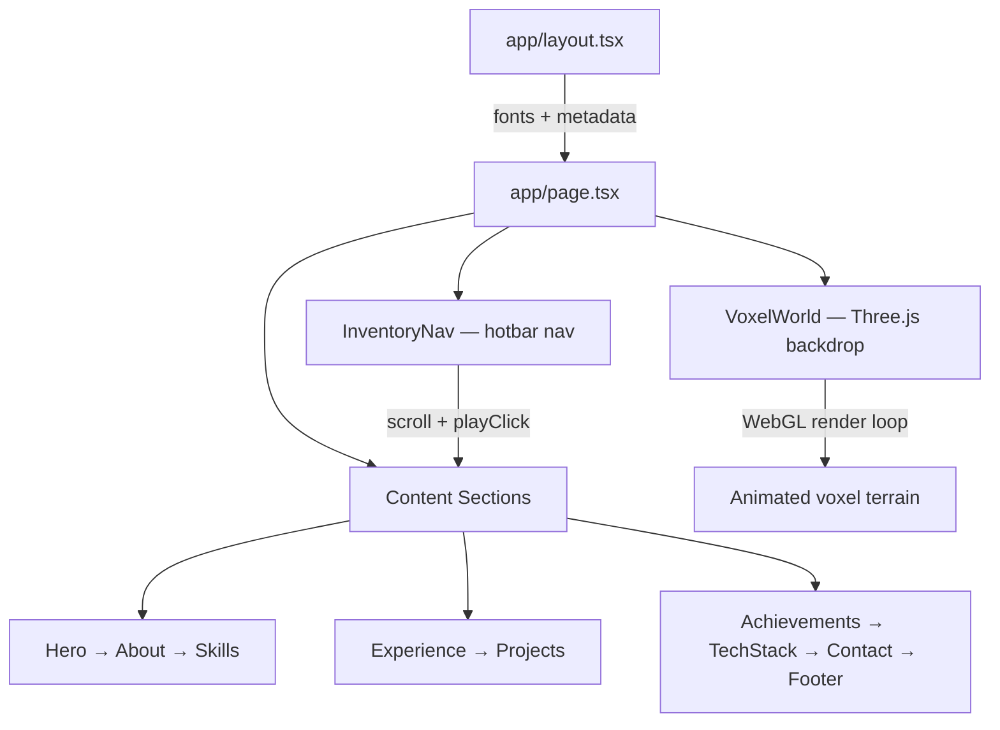

```
 █████╗ ███╗   ██╗██╗   ██╗██████╗ ██╗  ██╗ █████╗ ██████╗ 
██╔══██╗████╗  ██║██║   ██║██╔══██╗██║  ██║██╔══██╗██╔══██╗
███████║██╔██╗ ██║██║   ██║██████╔╝███████║███████║██████╔╝
██╔══██║██║╚██╗██║██║   ██║██╔══██╗██╔══██║██╔══██║██╔══██╗
██║  ██║██║ ╚████║╚██████╔╝██████╔╝██║  ██║██║  ██║██████╔╝
╚═╝  ╚═╝╚═╝  ╚═══╝ ╚═════╝ ╚═════╝ ╚═╝  ╚═╝╚═╝  ╚═╝╚═════╝ 

███████╗ █████╗ ██╗  ██╗ ██████╗  ██████╗ 
██╔════╝██╔══██╗██║  ██║██╔═══██╗██╔═══██╗
███████╗███████║███████║██║   ██║██║   ██║
╚════██║██╔══██║██╔══██║██║   ██║██║   ██║
███████║██║  ██║██║  ██║╚██████╔╝╚██████╔╝
╚══════╝╚═╝  ╚═╝╚═╝  ╚═╝ ╚═════╝  ╚═════╝ 
```

> **A Minecraft-inspired portfolio world** — explore skills, projects, and experience in a voxel-powered single-page adventure.

---

## 🌍 Live World Preview

| | |
|---|---|
| **Play Online** | [anubhabsahoo.dev](https://portfolio-nrxvudujw-anubhabhirekarma-1745s-projects.vercel.app/) |
| **Player** | Anubhab Sahoo — Full Stack / Java Backend Developer |
| **World Type** | Single-page portfolio with 3D voxel backdrop |

<p align="center">
  <a href="https://portfolio-nrxvudujw-anubhabhirekarma-1745s-projects.vercel.app/">
    
  </a>
</p>

<p align="center">
  <em>Click the avatar to enter the world →</em>
</p>

---

## 📋 World Info

| Stat | Value |
|------|-------|
| **Version** | `0.1.0` |
| **Difficulty** | Hardcore (Production-ready) |
| **Game Mode** | Creative Portfolio |
| **Render Engine** | Next.js App Router + Three.js WebGL |
| **License** | Private |

---

## 🎒 Inventory — Tech Stack

### Core Framework
| Item | Enchantment |
|------|-------------|
| **Next.js** `16.2.6` | App Router, SSR, SEO metadata |
| **React** `19.2.4` | Client & server components |
| **TypeScript** `5.x` | Type-safe crafting |

### Graphics & Motion
| Item | Enchantment |
|------|-------------|
| **Three.js** `0.184` | Voxel world WebGL canvas |
| **Framer Motion** `12.x` | Smooth scroll & UI animations |
| **Tailwind CSS** `4.x` | Pixel-perfect styling |
| **Lucide React** | Icon library |

### Audio & Utils
| Item | Enchantment |
|------|-------------|
| **Web Audio API** | 8-bit click, XP ding, level-up SFX |
| **clsx + tailwind-merge** | Conditional class merging |

### Dev Tools
| Item | Enchantment |
|------|-------------|
| **ESLint** `9.x` | Code linting |
| **PostCSS** | Tailwind pipeline |

---

## 🗺️ World Structure — Project Architecture

```
portfolio/
├── app/                        # Next.js App Router (spawn point)
│   ├── layout.tsx              # Root layout, fonts, SEO metadata
│   ├── page.tsx                # Main world — assembles all sections
│   └── globals.css             # Global styles & pixel theme
│
├── components/                 # Interactive world blocks
│   ├── Hero.tsx                # Spawn screen — avatar, roles, resume
│   ├── About.tsx               # Player lore & backstory
│   ├── Skills.tsx              # Enchantment table
│   ├── Experience.tsx          # Quest log / timeline
│   ├── Projects.tsx            # Built structures showcase
│   ├── Achievements.tsx        # Trophies & milestones
│   ├── TechStack.tsx           # Crafting materials
│   ├── Contact.tsx             # Multiplayer invite
│   ├── Footer.tsx              # World credits
│   ├── InventoryNav.tsx        # Hotbar navigation (Minecraft UI)
│   ├── ResumeViewer.tsx        # In-game book (PDF viewer)
│   └── ui/                     # Reusable UI blocks
│       ├── voxel-world.tsx     # Three.js 3D voxel canvas backdrop
│       ├── bento-grid.tsx      # Grid layout component
│       ├── timeline.tsx        # Experience timeline
│       └── ...                 # Spotlight, sparkles, etc.
│
├── lib/                        # Shared utilities
│   ├── audio.ts                # 8-bit sound synthesizer (Web Audio)
│   └── utils.ts                # Tailwind class helper (cn)
│
└── public/                     # Static assets
    ├── profile.png             # Player skin
    └── resume.pdf              # Downloadable resume
```

### How the World Loads



**Layer model:**
1. **Background layer** — `VoxelWorld` renders a full-screen Three.js voxel scene behind all content.
2. **Navigation layer** — `InventoryNav` floats as a Minecraft hotbar with pixel icons and click sounds.
3. **Content layer** — Section components sit on top with selective pointer events for interactivity.

---

## ⚒️ Crafting Recipe — Setup

### Requirements
- **Node.js** 18+ (recommended: 20 LTS)
- **npm** (comes with Node.js)

### Step 1 — Clone the world

```bash
git clone https://github.com/Shriyansh2004/portfolio.git
cd portfolio
```

### Step 2 — Install dependencies

```bash
npm install
```

---

## ▶️ Launch Game — Run

### Development (Creative Mode)

```bash
npm run dev
```

Open **[http://localhost:3000](http://localhost:3000)** in your browser.

> The world hot-reloads as you edit files — no respawn required.

### Production Build (Survival Mode)

```bash
npm run build
npm start
```

### Lint Check

```bash
npm run lint
```

---

## 🎮 Controls

| Action | Input |
|--------|-------|
| Navigate sections | Click hotbar items in the inventory nav |
| View projects | Scroll or use hotbar → Projects |
| Open resume | Click **View Resume** on the hero screen |
| Download CV | Click **Download CV** button |
| Sound effects | Automatic on nav clicks (Web Audio API) |

---

## 🌐 Deploy

This world is built for [Vercel](https://vercel.com). Push to your repo and connect — Next.js deploys out of the box.

Live deployment: **[anubhabsahoo.dev](https://anubhabsahoo.dev)**

---

## 📬 Contact the Player

| Platform | Link |
|----------|------|
| **Email** | sanubhab629@gmail.com |
| **GitHub** | [github.com/Shriyansh2004](https://github.com/Shriyansh2004) |
| **LinkedIn** | [linkedin.com/in/anubhab-sahoo-76a9302b7](https://www.linkedin.com/in/anubhab-sahoo-76a9302b7) |

---

<p align="center">
  <strong>© 2026 ANUBHAB SAHOO — ALL RIGS SECURED</strong><br/>
  <em>Built block by block with Next.js, Three.js, and a love for pixel art.</em>
</p>
